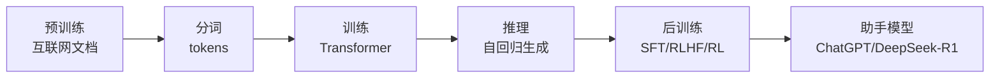

# Deep Dive into LLMs K神讲解笔记
这篇笔记基于 Karpathy 的长视频《Deep Dive into LLMs》，把现代大语言模型（LLM）的“全生命周期”串成一条线：从互联网预训练、分词、训练与推理，到后训练（SFT、RLHF、DeepSeek-R1 等推理模型），再谈到“LLM 心理学”、幻觉、工具使用和未来趋势。
整体结构可以概括为：

---
## 1. 预训练：把“互联网”压缩进神经网络
### 1.1 数据：FineWeb 与互联网规模文本
Karpathy 以 Hugging Face 的 **FineWeb** 数据集为例，展示了一个现代 LLM 预训练数据的典型规模：  
- 约 **44TB 磁盘空间**  
- 约 **15 万亿 token**  
- 来自 Common Crawl 等公开网页，经过 URL 过滤、文本提取、语言过滤、去重、PII 去除等多阶段清洗。
这对应的是“把互联网下载下来，再洗一遍”的过程：  
- 起点是 Common Crawl 的海量原始网页；  
- 过滤掉恶意、营销、成人等低质/有害网站；  
- 提取正文文本，过滤语言（例如只保留英文比例 >65% 的页面）；  
- 去重、处理个人隐私信息，得到高质量、高多样性的文本语料。
从认知的角度，你可以把预训练阶段类比成：**一个人把图书馆和互联网读了一遍，在脑子里形成了一个模糊的、统计性的“世界模型”**。
### 1.2 分词：从文本到 tokens
模型看到的不是字符，而是 **token**。  
Karpathy 用 tiktokenizer 可视化了 GPT-4 的分词方式（cl100k_base）：

- 词汇表大约 **10 万左右** 的 token（GPT-4 约为 100,277）；  
- 常见的子串（如 “the”, “tion”, “ing”）会被合并成一个 token；  
- 同一段文字在不同 tokenizer 下会被切成不同的 token 序列。
分词本质上是：  
- 把一维文本流映射到一维 token ID 序列；  
- 在“词表大小”和“序列长度”之间做权衡：  
  - 纯字符级：词表小、序列极长；  
  - 更粗粒度的 token：词表更大、序列更短、训练更高效。
  所以：**LLM 的世界就是 token 序列的世界**，一切后续训练和推理都建立在这个“原子单位”之上。
### 1.3 训练神经网络：Transformer 与“下一个 token 预测”
Karpathy 用一个简单的示意图说明训练过程：
- 输入：一段 token 序列（长度在 0 到某个上限之间，比如 8k tokens）；  
- 输出：词表中每个 token 作为“下一个 token”的概率；  
- 目标：让“正确答案”的概率更高。
训练时，从数据集中随机取出一批窗口，比如前 4 个 token 作为上下文，预测第 5 个 token。  
通过 **梯度下降**，不断调整神经网络的参数（几十亿甚至上千亿个），使得：
- 在大量训练样本中，模型输出的分布逐渐接近训练语料的统计分布；  
- 模型学会了“什么样的 token 序列更可能出现”。
Karpathy 展示了一个 Transformer 的可视化演示，强调：
- 模型本质上是一个 **参数巨大的数学函数**；  
- 没有显式的“知识库”，所有知识都编码在参数里；  
- 每个前向传播的“计算量”是有限的，不可能在单个 token 上做极复杂的推理。
### 1.4 推理：自回归生成与随机性
推理阶段就是“续写”：给定一段前缀，不断预测下一个 token，再把新的 token 加回上下文，继续预测。
关键点：
- 模型输出的是 **概率分布**；  
- 我们以一定的概率采样下一个 token（“掷有偏的硬币”）；  
- 所以：同样的前缀，多次生成会得到不同结果。
Karpathy 用一个小例子说明：模型可以生成和训练集高度相似的段落，也可以“编造”出训练集中从未出现过的 token 序列——统计上像，但不是逐字复现。
### 1.5 Demo：GPT-2 与 Llama 3 base 模型
Karpathy 以 **GPT-2** 为例，展示了一个“现代但小得多”的 LLM：
- 参数量：约 **1.5B**；  
- 上下文长度：约 **1024 tokens**；  
- 训练数据：约 **100B tokens**（远小于现在的 15T 规模）。
他提到，现在复现 GPT-2 的训练成本已经从当年的 ~$40k 降到几百美元级别，主要得益于：
- 更高质量的数据集；  
- 更强的硬件（H100 等）；  
- 更高效的训练软件栈。
**Base 模型**的本质：  
- 它只是一个 **互联网文档 token 模拟器**；  
- 可以看作对互联网的“有损压缩”：  
  - 不是精确的数据库，而是模糊的、概率性的回忆；  
  - 对高频内容记忆更清楚，对罕见内容更容易出错或编造。
  Karpathy 还提到 **Llama 3** 系列：  
- 发布了 8B 和 70B 两种规模的预训练和指令微调模型；  
- 预训练使用超过 15T token 的数据，训练在大量 GPU 集群上完成。
---
## 2. 后训练：从 Base 模型到“助手”
预训练得到的 base 模型只是“会续写文本”，还不会像 ChatGPT 那样一问一答。后训练阶段就是把“续写机器”变成“对话助手”。
### 2.1 监督微调（SFT）：用对话数据“编程”模型
Karpathy 用一个类比：  
- 预训练：读教科书里的正文；  
- SFT：读教科书里的“例题 + 详细解答”。
核心做法：
1. 收集大量 **多轮对话数据**（Human–Assistant 形式）；  
2. 标注员根据公司写的“标注手册”写出理想回复；  
3. 把对话转成 token 序列，继续训练 base 模型。
对话数据通过特殊的“协议”编码成 token 序列，例如：
- 特殊 token 标记每个角色的开始/结束（如 `<|im_start|>user`, `<|im_end|>`, `<|im_start|>assistant` 等）；  
- 这些 token 在训练时被引入，模型学会区分不同角色和对话结构。
Karpathy 强调：
- SFT 数据现在往往大量借助已有 LLM 生成，再由人类编辑；  
- 数据质量和多样性对最终模型行为影响巨大；  
- SFT 阶段虽然训练时间短，但对“人格”“安全性”“回答风格”影响很大。
### 2.2 RLHF：用人类偏好训练奖励模型
对于“写一个笑话”“写一首诗”这类 **不可自动验证的任务**，如何做强化学习？  
Karpathy 介绍了经典的 RLHF 流程：
1. 生成多个候选回复；  
2. 人类标注员对它们进行排序（而不是打分）；  
3. 训练一个 **奖励模型（reward model）**，让它学会模仿人类排序；  
4. 用这个奖励模型作为“模拟人类”，对模型做 RL。
RLHF 的优点：
- 可以在开放域任务上引入 RL，而不仅限于可验证任务；  
- 标注任务更简单（排序 vs 写出理想回复）。
但 RLHF 也有明显的局限：
- 奖励模型只是一个“人类偏好的有损模拟”；  
- RL 容易学会“钻空子”——找到能骗高奖励但人类并不满意的输出；  
- 所以通常 RLHF 训练步数有限，更像“最后的精修”，而不是无限制的强化学习。
Karpathy 的总结很直白：**RLHF 不是“真正的 RL”，只是带缺陷的微调阶段。**
### 2.3 DeepSeek-R1：通过 RL 激发“推理模型”
Karpathy 重点介绍了 **DeepSeek-R1**：
- 这是一系列开放权重的推理模型，通过大规模 RL 训练，专注于数学、代码等可验证任务；  
- 论文中展示了随着 RL 训练推进，模型在数学问题上的准确率逐步提升；  
- 同时，模型回复的平均长度显著增加——它在“学会思考”。
DeepSeek-R1 的几个关键点：
- 有 DeepSeek-R1-Zero，几乎完全依靠 RL 从 base 模型练出推理能力；  
- 也有 DeepSeek-R1，引入少量冷启动 SFT 数据，再做 RL，可读性和稳定性更好；  
- 模型会自我检查、回溯、尝试多种解法，表现出类似人类“内心独白”的行为；  
- 权重开源，还有多种蒸馏版本（1.5B、7B、8B、14B、32B、70B）方便社区使用。
Karpathy 的类比：**RL 就像学生做大量练习题并自己总结解题策略，而不是只看老师写好的例题。**
---
## 3. LLM 心理学：幻觉、自知识与“思考需要 token”
Karpathy 用“LLM 心理学”这个词，讨论了一些有趣的认知特性。
### 3.1 幻觉（hallucination）
模型会自信地编造事实，原因包括：
- 训练数据里，问题往往有“自信回答”，即使标注员不确定；  
- 模型没有“我不确定”的输出经验；  
- 内部某些“不确定信号”没有连接到语言输出。
缓解方法：
- **知识边界探测**：对模型提出大量事实性问题，自动判断它是否真正掌握；  
- 在训练集中加入“我不知道”的样本，把不确定性与输出行为关联起来。
此外，通过 **工具调用（如联网搜索）**，可以显著减少幻觉：  
- 模型决定何时需要查资料；  
- 查询结果被写进上下文窗口，相当于“临时工作记忆”；  
- 模型再基于这些资料生成答案。
### 3.2 自知识与“你是谁？”
Karpathy 提醒：模型没有持久的“自我”。  
每次对话都是：
- 把当前 token 序列喂给模型；  
- 模型做一次前向传播，输出下一个 token 的分布；  
- 生成结束后，状态被丢弃。
所以问“你是什么模型？”本质上是在问：  
“在训练数据里，像这样的问题通常怎么回答？”
如果训练集中没有专门关于自身的信息，模型往往会根据统计规律“编一个身份”。  
一些团队（如 OLMo）会硬编码少量问答，让模型对“你是谁”有相对稳定的回答。
### 3.3 “思考需要 token”：计算分布与推理瓶颈
Karpathy 强调一个关键点：**每个 token 对应的计算量是有限的**。
例子：  
- 简单数学题，如果要求模型在极短输出中直接给出答案，容易出错；  
- 如果引导模型写清楚每一步中间计算，答案往往更可靠。
原因是：
- 模型只能在有限层的前向传播里做推理；  
- 把复杂推理拆成多个 token，相当于“把计算摊到多个步骤上”；  
- 每一步只需要做相对简单的子决策。
这也解释了：  
- 模型不太擅长精细的字符级任务（比如“打印字符串的第 3、6、9 个字符”），因为 tokenizer 把多个字符合并成一个 token；  
- 解决方法：让模型写代码，用 Python 等工具做字符操作。
---
## 4. 工具使用与未来方向
### 4.1 工具调用：搜索与代码执行
Karpathy 展示了现代助手模型如何通过工具弥补自身不足：
- **联网搜索**：  
  - 模型输出特殊 token 触发搜索；  
  - 搜索结果被写进上下文窗口；  
  - 模型再基于这些内容生成带引用的回答。  
- **代码解释器**：  
  - 模型写代码，交给解释器执行；  
  - 结果返回给模型，再组织成自然语言回复。
  这对应一个重要观点：  
- **参数里的知识 = 模糊回忆**；  
- **上下文窗口里的信息 = 工作记忆**。  
把信息写进上下文，就像人类把信息记在纸上再处理，比完全依赖记忆可靠得多。
### 4.2 多模态、Agent 与更长上下文
Karpathy 简要展望了几个趋势：
1. **多模态 LLM**：  
   - 音频、图像都可以被“token 化”，加入同一套训练管线；  
   - 未来模型会“原生”支持看图、听音频、生成图像/音频。
2. **Agent**：  
   - 目前模型更多是“单个任务”的执行者；  
   - 未来会更多扮演“长期运行、自主规划、人类监督”的智能体。
3. **更长上下文与“测试时训练”**：  
   - 随着多模态和长任务，上下文窗口会越来越大；  
   - 研究者也在探索“测试时训练”——让模型在推理过程中更新部分参数，而不是完全固定。
---
## 5. 实用视角：如何使用和看待 LLM
Karpathy 最后给出一些建议：
1. **不要把 LLM 当作全知全能的“AI 人格”**，而要把它当成：  
   - 一个“统计上模仿人类标注员”的系统；  
   - 一个“能做很多事、但有随机漏洞的工具”。
2. 对重要任务：  
   - 尽量把关键信息写进上下文，而不是依赖模型记忆；  
   - 让模型展示推理过程或使用工具（代码、搜索），减少幻觉；  
   - 自己检查关键结果。
3. 对于复杂推理任务：  
   - 可以尝试 DeepSeek-R1 或 OpenAI 的 o1/o3 等“推理模型”；  
   - 它们通过 RL 学会了更长的“思维链”，但仍然不是绝对可靠。
---
## 小结
Karpathy 的这篇讲解，从“底层实现”和“工程实践”两个维度，把 LLM 的训练和使用讲得非常通透：
- **预训练**：把互联网变成 token 序列，训练一个巨大的 Transformer，学会“下一个 token”的统计分布。  
- **后训练**：通过 SFT、RLHF 和 RL，把 base 模型塑造成“助手”，甚至“推理专家”。  
- **使用**：理解模型的局限性（幻觉、token 级计算瓶颈、无持久自我），善用工具和上下文窗口，把它当作一个强大但需要监督的工具。
如果你正在做 LLM 应用或研究，这篇视频和这篇笔记都值得反复看几遍。